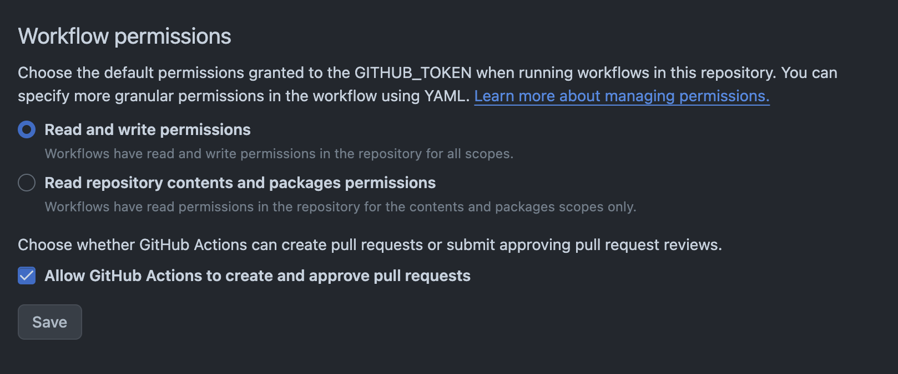

# Github Workflow

To use the Github Workflow integration, you need to create a `.github/workflows/pixee.yml` file in your repository.

The following is an example of a Github Workflow file that uses the Pixee CLI to create a PR:

```yaml

name: 'Pixee'

on:
  pull_request:
    branches:
      - main
    types: [opened, reopened, synchronize]

jobs:
  pixee_fix:
    runs-on: ubuntu-latest
    permissions:
      pull-requests: write
      contents: write
    steps:
      - name: Checkout code
        uses: actions/checkout@v4
      - name: Run Python script to create PR
        uses: docker://codemodder/ci-integrations
        env:
          GITHUB_TOKEN: ${{ secrets.GITHUB_TOKEN }}

```

You also need may need to set the following premissions in your repository:


